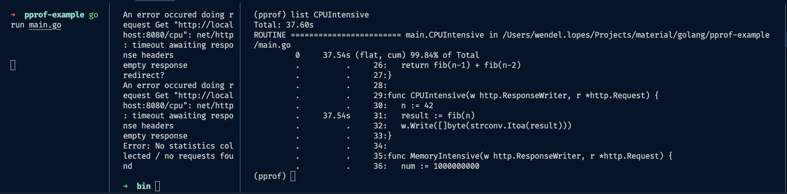

## PPROF - Golang tool example

Doc de como utilizar profiling no Golang

### Pré requisitos
1. Instale a ferramenta para testes de carga: GO-WRK 
https://github.com/tsliwowicz/go-wrk

### Gargalos de CPU

A função CPUIntensitve, como o nome diz, realiza um processamento intenso de CPU, o que consequentemente ocasiona um gargalo na aplicação. Nesse exemplo, utilizaremos o PPROF para realizar um profiling na aplicação e justamente identificar o ponto a ser melhorado.

##### Executando
1. Suba os servidores com o comando: <code>go run main.go</code>
2. Em outra aba no terminal, execute o teste de carga com o comando: <code>./go-wrk -c 15 -d 15 http://localhost:8080/cpu</code>.
3. Enquanto o teste de carga acima estiver sendo executado, execute o profiling com o comando: <code>go tool pprof -seconds 5 http://localhost:6060/debug/pprof/profile</code>

##### PProf
No terminal de execução do profiling, a tool pprof estará habilitada. Dessa forma, alguns comandos podem ser executados para identificar os pontos problemáticos no código.

* <b>TOP</b>: Digite top n (ex: top 10 ou top 20) para visualizar os itens que mais gargalaram sua aplicação. Certamente, o main.fib estará entre os primeiros. Na imagem abaixo, é possível identificar que a função levou 37.42s para ser finalizada.

* <b>LIST</b>: Se houver interesse em saber o quanto determinada função está gastando de CPU, é possível realizar buscas por Regex. A nível de exemplo, digite <b>list "regex"</b> (ex: list CPUIntensitve). Observe que o trecho de código "<u>result := fib(n)</u>" da minha função <u>main.CPUIntensitve</u> levou 37.54s para ser executado.

