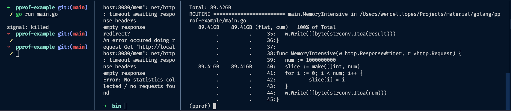

## PPROF - Golang tool example

Doc de como utilizar profiling no Golang

### Pré requisitos
1. Instale a ferramenta para testes de carga: GO-WRK 
https://github.com/tsliwowicz/go-wrk

### Identificando gargalos

As funções CPUIntensitve e MemoryIntensive intensionalmente ocasionam gargalos na aplicação. Nos exemplos abaixo, utilizaremos o PPROF para identificar pontos de melhoria.

1. Suba os servidores com o comando: <code>go run main.go</code>
2. Em outra aba no terminal, execute o teste de carga com o comando: <code>./go-wrk -c 15 -d 15 http://localhost:8080/cpu</code>.
3. Enquanto o teste de carga acima estiver sendo executado, execute um dos comandos abaixo, de acordo com a necessidade:
- Identificar gargalos de CPU: <code>go tool pprof -seconds 5 http://localhost:6060/debug/pprof/profile</code>
- Identificar gargalos de  Memória: <code>go tool pprof http://localhost:6060/debug/pprof/allocs</code>

#### PProf
Após a execução dos comandos acima, no terminal de execução do profiling, a tool pprof estará habilitada. Dessa forma, alguns comandos podem ser executados para identificar os pontos problemáticos no código.

##### >> TOP
* Uso: <code>top n</code> (top 10, top 20, etc...)

Com este comando é possível visualizar os itens que mais gargalaram sua aplicação. 

Para o caso de CPU, certamente, o main.fib estará entre os primeiros. Na imagem abaixo, é possível identificar que a função levou 37.42s para ser finalizada.

Já para a memória, certamente, é possível identificar a função main.MemoryIntensive como a que se destaca pelo seu consumo.

##### >> LIST
* Uso: <code>list "text"</code> (ex: list CPUIntensitve)

Se houver interesse em saber o quanto determinada função está gastando de recursos, é possível realizar buscas por Regex, com o comando List.

Observe que o trecho de código "<u>result := fib(n)</u>" da minha função <u>main.CPUIntensitve</u> levou 37.54s para ser executado.

Informações relevantes sobre qual trecho de código está consumindo mais memória, podem ser observados também.

##### >> WEB
* Uso: <code>web</code>

O comando web trás uma interface visual sobre o passo a passo e o consumo de cada um desses
